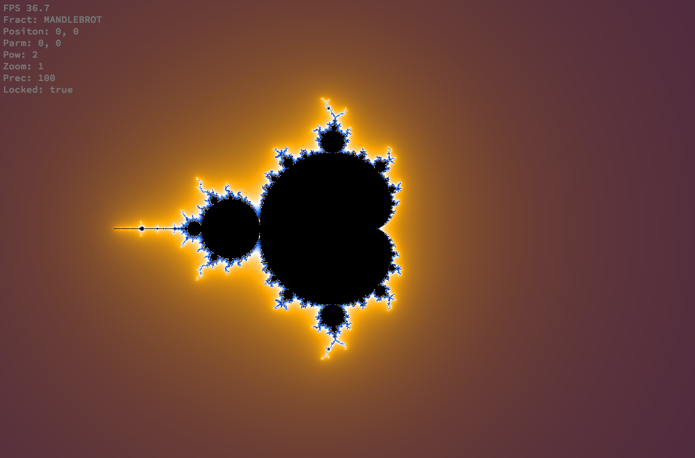
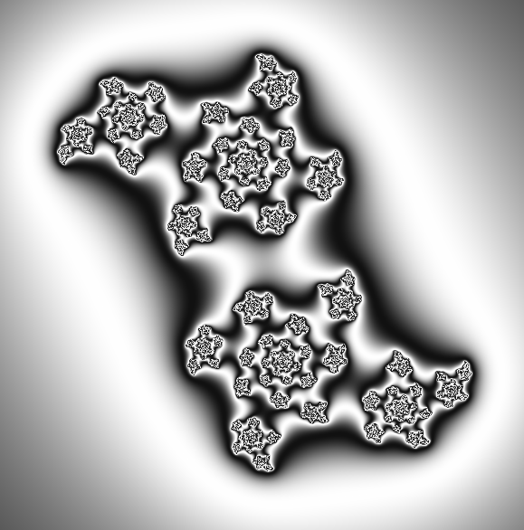
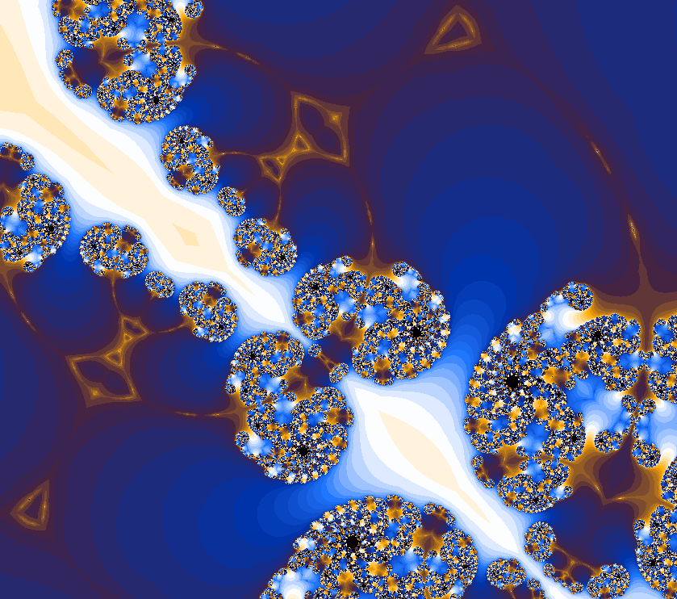
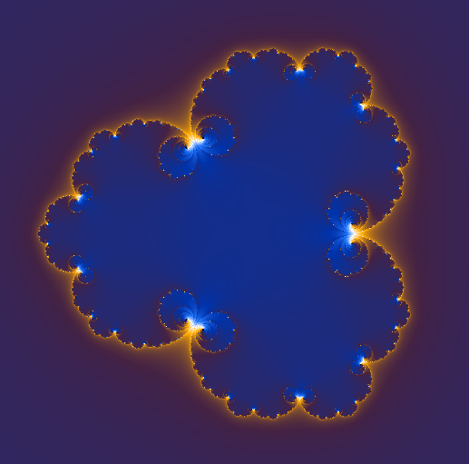
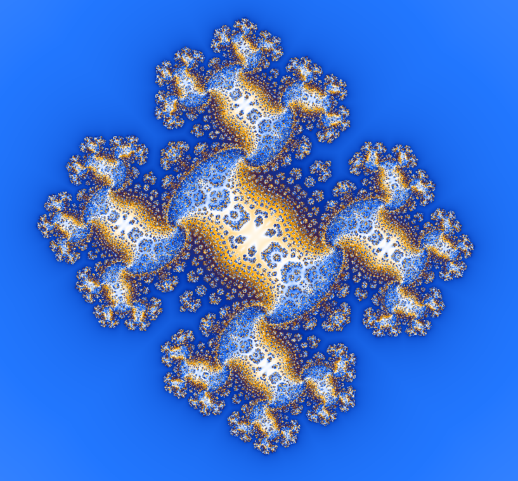
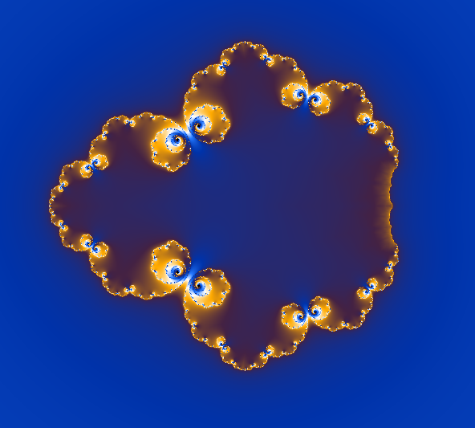

# fractol

This project generates and displays a few different fractals.
The available fractals are Mandlebrot, Julia, and a many of their variations, including some presets.

The available presets are : mandlebrot, burning ship, julia and 3 other julia variations.

## Custom fractals

Other kinds of fractals can be generate by altering the original formula : for both Mandlebrot an Julia, the formula is z[n + 1] = z[n]^2 + c.

The first modification we can add to this formula is changing the power z(n) is raised to, in this project this can be any integral power greater then 1.

The other kind of modification is done by altering the sign of z[n], this can be done before or after applying the power, on either part of the complex number, by either taking the absolute or the opposite of the number.

## Controls

- ESC : quit the program
- Arrow keys : shifts the focus
- Mouse wheel : zooms in/out
- Mouse cursor : changes the fractal's second paramter (z[0] for Mandlebrot-likes, c for for Julia-likes)
- K : locks/unlocks the current second parameter
- R : resets the first paramter, zoom, and position of the focus
- L/M : decreases/increses the precision
- C : switches between continuous and discrete coloring
- 0 : switches between the 3 color paletts
- G : switches the color cycling between deactivated/normal/inverted
- 1-6 : switches between the different fractals presets
- Shift + L/M : decreases/increases the fractal's power
- Shift + 1-8 : switches the different fractal customisations on/off
  + 1 : absolute real part before raising to power
  + 2 : negative real part before raising to power
  + 3 : absolute imaginary part before raising to power
  + 4 : negative imaginary part before raising to power
  + 5 : absolute real part after raising to power
  + 6 : negative real part after raising to power
  + 7 : absolute imaginary part after raising to power
  + 8 : negative imaginary part after raising to power

## Images

Mandlebrot

Julia with a different color palette

Zoom on Julia with discrete coloring

Julia with power setting to 3

One of the Julia presets

Another Julia preset

